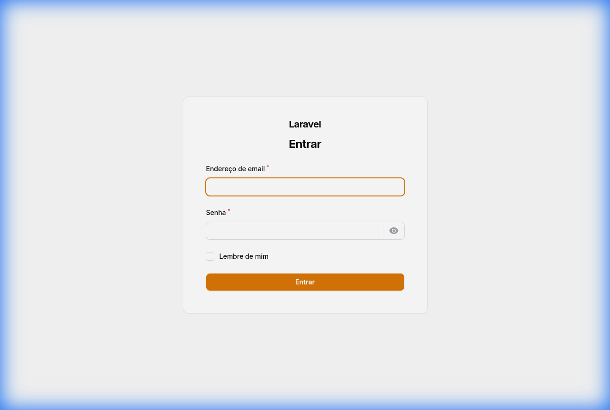
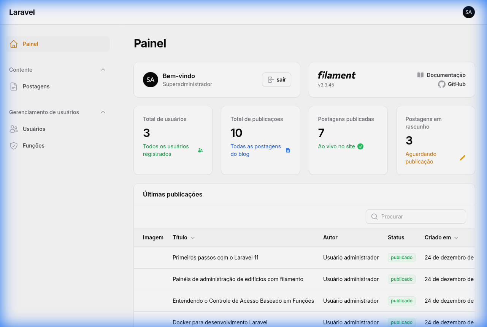
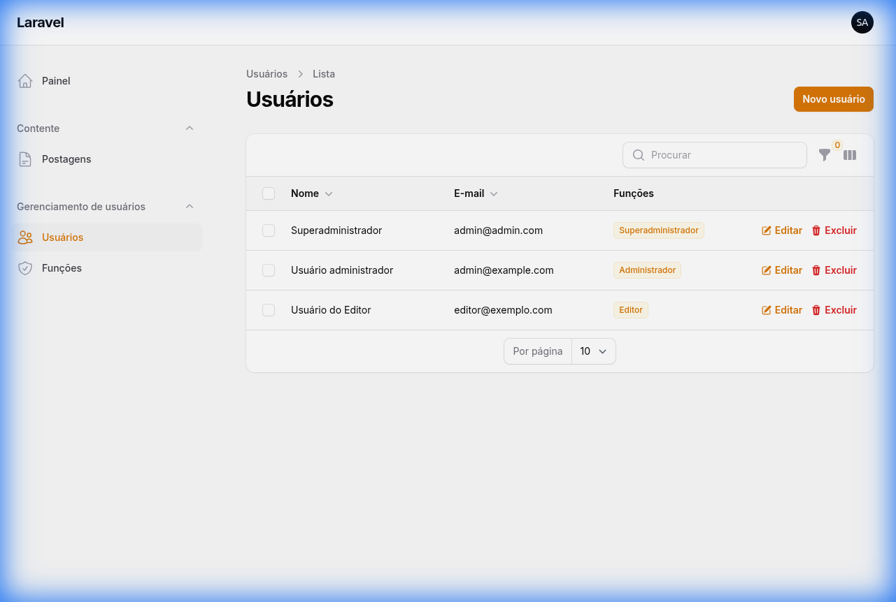
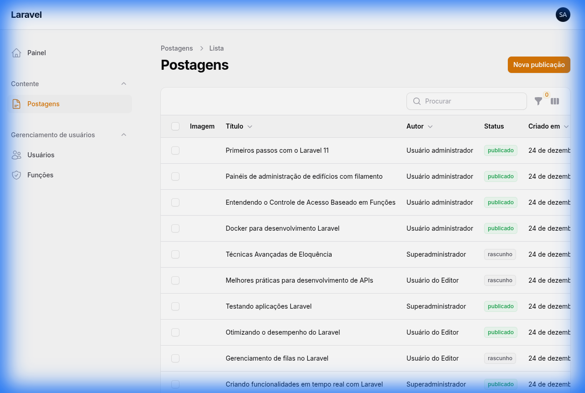
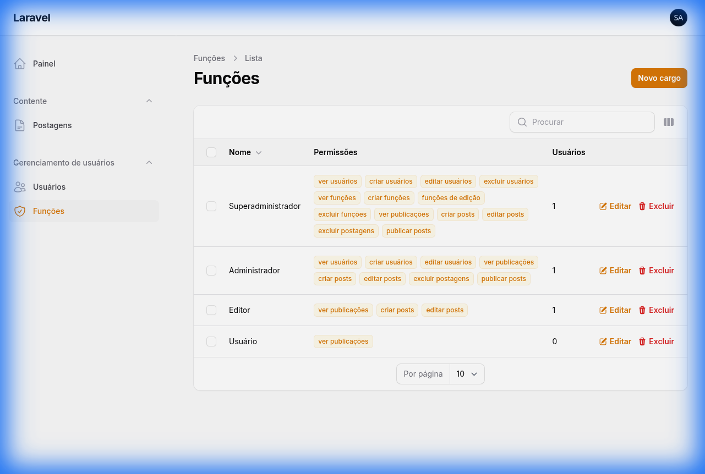

# Filament Admin Starter

<div align="center">


**A professional, production-ready admin panel starter built with Laravel 11 and Filament 3**

[Features](#-features) • [Screenshots](#-screenshots) • [Installation](#-installation) • [Usage](#-usage) • [Tech Stack](#-tech-stack)

</div>

---

## ✨ Features

### 🔐 Authentication & Authorization
- **Filament 3** admin panel with beautiful UI
- **Role-Based Access Control (RBAC)** using Spatie Permission
- Pre-configured roles: Super Admin, Admin, Editor, User
- Granular permissions system
- Secure password hashing

### 👥 User Management
- Complete CRUD operations for users
- Role assignment and management
- User filtering by roles
- Password management
- Email validation

### 📝 Content Management
- **Posts CRUD** with rich text editor
- **File upload** with image editor
- Featured image support with multiple aspect ratios
- Auto-generated slugs
- Draft and Published status
- Author tracking

### 🎨 Dashboard
- **Statistics widgets** showing:
  - Total users count
  - Total posts count
  - Published posts count
  - Draft posts count
- **Latest posts widget** with quick actions
- Responsive and modern UI

### 🛠️ Developer Experience
- **Docker** configuration included (PHP, MySQL, Nginx, PHPMyAdmin)
- Clean code structure
- Well-documented
- `.env.example` for easy setup
- Database seeders with sample data

---

## 📸 Screenshots

### Login Page


### Dashboard with Statistics

*Real-time statistics showing user count, post count, published and draft posts, plus a latest posts widget*

### User Management

*Complete user CRUD with role assignment and filtering*

### Post Management

*Blog posts with featured images, status badges, and author tracking*

### Role & Permission Management

*RBAC system with 4 roles and granular permissions*

---

## 🚀 Installation

### Prerequisites
- PHP 8.2 or higher
- Composer
- MySQL 8.0 or higher
- Node.js & NPM (for asset compilation)
- Docker & Docker Compose (optional)

### Option 1: Local Installation

1. **Clone the repository**
```bash
git clone <your-repo-url> filament-admin-starter
cd filament-admin-starter
```

2. **Install dependencies**
```bash
composer install
npm install
```

3. **Environment setup**
```bash
cp .env.example .env
php artisan key:generate
```

4. **Configure database**
Edit `.env` file with your database credentials:
```env
DB_CONNECTION=mysql
DB_HOST=127.0.0.1
DB_PORT=3306
DB_DATABASE=filament_admin
DB_USERNAME=your_username
DB_PASSWORD=your_password
```

5. **Run migrations and seeders**
```bash
php artisan migrate:fresh --seed
```

6. **Create storage symlink**
```bash
php artisan storage:link
```

7. **Compile assets**
```bash
npm run build
```

8. **Start development server**
```bash
php artisan serve
```

9. **Access the admin panel**
```
URL: http://localhost:8000/admin
Email: admin@admin.com
Password: password
```

### Option 2: Docker Installation

1. **Clone the repository**
```bash
git clone <your-repo-url> filament-admin-starter
cd filament-admin-starter
```

2. **Environment setup**
```bash
cp .env.example .env
```

3. **Build and start containers**
```bash
docker-compose up -d
```

4. **Install dependencies inside container**
```bash
docker-compose exec app composer install
docker-compose exec app npm install
```

5. **Generate application key**
```bash
docker-compose exec app php artisan key:generate
```

6. **Run migrations and seeders**
```bash
docker-compose exec app php artisan migrate:fresh --seed
```

7. **Create storage symlink**
```bash
docker-compose exec app php artisan storage:link
```

8. **Compile assets**
```bash
docker-compose exec app npm run build
```

9. **Access the application**
```
Admin Panel: http://localhost:8080/admin
PHPMyAdmin: http://localhost:8081

Credentials:
Email: admin@admin.com
Password: password
```

---

## 📖 Usage

### Default Credentials

The seeder creates three test accounts:

| Role | Email | Password |
|------|-------|----------|
| Super Admin | admin@admin.com | password |
| Admin | admin@example.com | password |
| Editor | editor@example.com | password |

### Creating New Users

1. Navigate to **User Management > Users**
2. Click **New User**
3. Fill in the form (name, email, password)
4. Assign roles
5. Click **Create**

### Managing Posts

1. Navigate to **Content > Posts**
2. Click **New Post**
3. Fill in title (slug auto-generates)
4. Write content using the rich text editor
5. Upload a featured image
6. Select author and status
7. Click **Create**

### Managing Roles & Permissions

1. Navigate to **User Management > Roles**
2. Click on a role to edit
3. Assign or remove permissions
4. Save changes

---

## 🛠️ Tech Stack

### Backend
- **Laravel 11** - PHP Framework
- **Filament 3** - Admin Panel Framework
- **Spatie Laravel Permission** - Role & Permission Management
- **MySQL 8.0** - Database

### Frontend
- **Livewire 3** - Dynamic UI Components
- **Alpine.js** - JavaScript Framework
- **Tailwind CSS** - Utility-first CSS Framework

### DevOps
- **Docker** - Containerization
- **Docker Compose** - Multi-container orchestration
- **Nginx** - Web Server
- **PHPMyAdmin** - Database Management

---

## 📁 Project Structure

```
filament-admin-starter/
├── app/
│   ├── Filament/
│   │   ├── Resources/
│   │   │   ├── UserResource.php
│   │   │   ├── RoleResource.php
│   │   │   └── PostResource.php
│   │   └── Widgets/
│   │       ├── StatsOverview.php
│   │       └── LatestPosts.php
│   └── Models/
│       ├── User.php
│       └── Post.php
├── database/
│   ├── migrations/
│   └── seeders/
│       ├── RolePermissionSeeder.php
│       ├── AdminUserSeeder.php
│       └── PostSeeder.php
├── docker/
│   ├── nginx/
│   │   └── default.conf
│   └── php/
│       └── local.ini
├── docker-compose.yml
├── Dockerfile
└── .env.example
```

---

## 🔒 Security

- Passwords are hashed using bcrypt
- CSRF protection enabled
- SQL injection prevention via Eloquent ORM
- XSS protection
- Role-based access control

**Important**: Change default credentials in production!

---

## 🤝 Contributing

Contributions are welcome! Please feel free to submit a Pull Request.

---

## 📝 License

This project is open-sourced software licensed under the [MIT license](https://opensource.org/licenses/MIT).

---

## 🙏 Acknowledgments

- [Laravel](https://laravel.com)
- [Filament](https://filamentphp.com)
- [Spatie](https://spatie.be)

---

<div align="center">

**Built with ❤️ for the Laravel community**

⭐ Star this repo if you find it helpful!

</div>
